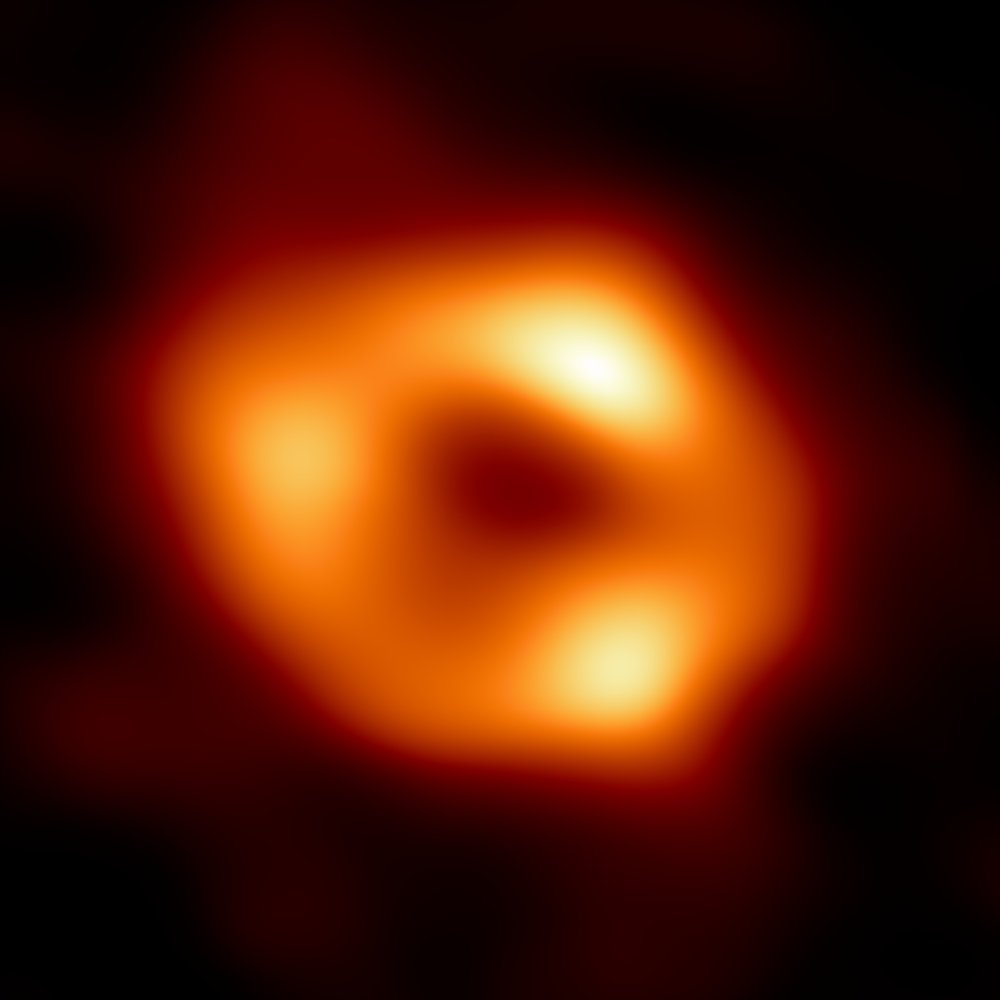
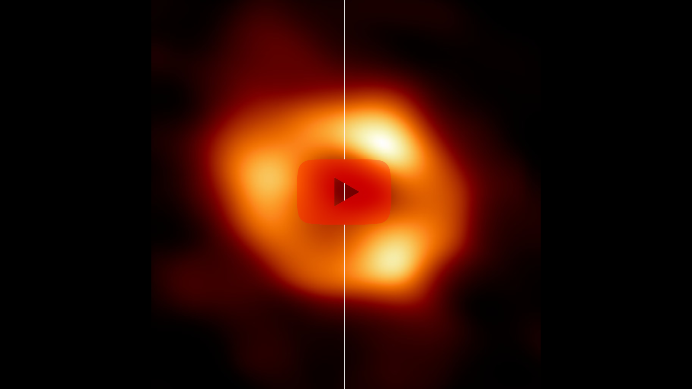

# .midi

Ya, okay, I got sidetracked. Actually I got some drafts laying around with topics about other stuff but I can't really bother myself now to examine and plan the todos and stuff for this. Currently I am browsing a lot within the topic of sonification. There's a really cool [book](https://sonification.de/handbook/) I found and there's so much stuff going on in the astronomy world (like [EHT](https://eventhorizontelescope.org/)) that I really can't keep track with everything - especially not with my own project. But with the new image of Sagittarius A* I got some inspiration on experimenting on stuff.

To clarify the goal of this piece: I want to find a method on how I can listen to this particular picture of Sgr A\*.

## The plan

The goal is to procude a midi file containing the data of this picture and I got some ideas on how to approach this.

The first thing is that I wanted to understand are the properties of a pixel. Luckily I am a trained media designer so I actually now stuff about this. First the basics: A pixel is a point within a raster graphic (nothing else than a coordinate system) and the information about the values of red, green and blue. We are looking and processing the image on a computer screen so we are looking at an additive color system called RGB color system ([wikipedia](https://en.wikipedia.org/wiki/RGB_color_spaces)).

I have some problems with this color system. Even though it gives me information about the actual color but with these values it's not easy to translate this data directly into a midi note. Knowing this I need to understand the properties of a one single midi note which is not that complicated because I got only five important values: channel, velocity, note, time and type ([midi file format](http://www.music.mcgill.ca/~ich/classes/mumt306/StandardMIDIfileformat.html)).

Knowing this I need to decide on the channel, velocity and note by the properties of the pixel. With the coordinates in the raster I have the values for the time (start and duration). And the property type is basically the same throughout the project. Thinking about the other needed values I consider the saturation of a pixel as velocity, the actual color as note (whereas I need to define surrounding requirements, later more on this) and the greyscale value as channel.

This means that I need to convert the RGB values of a pixel to a different color system to actually get these kind of values relatively easy. Luckily there is the color system [HSL/HSV](https://en.wikipedia.org/wiki/HSL_and_HSV) which provides the needed values out of the box (hue, saturation, lightness). With that I have all the needed information about the midi file I want to produce (except of the actual speed but that's something to play with).

## The image and more decisions

Let's take a look at the picture of our black hole and investigate some ideas with the knowledge from above:

Examining this image on the first glance I already see some issues.

1. The darkness. This will generate so many notes that the midi file just will sound like noise (which is not bad - actually without noise, no universe). I want to move this to a more or less static background. Therefore I need the possibility to use adjacent pixel and compare them to the original pixel. If the values are more or less the same I can combine them and add duration to the note.
1. 4076x4076 is a relatively high resolution for this project. It contains 16.613.776 pixels. I'm going down with the resolution to a reasonable one which lookes like 512x512 to me. This results in just 262.144 pixels to convert and check.
1. Even though the image is circular but for the sake of simplicity I just let the image read row by row from left to right.

## The math

There's not that much math involved here. I just need to convert RGB to HSL/HSV and the HSL/HSV-values to the midi format.

### RGB to HSV

I'm happy that [wikipedia](https://en.wikipedia.org/wiki/HSL_and_HSV#From_RGB) actually got the formular for this and I am definitly way too lazy to explain this. When done correctly I get these values:

* H as element of natural numbers and between 0 and 360
* S as element of natural numbers and between 0 and 100
* V as element of natural numbers and between 0 and 100

### HSV to midi

As described above I define this:

#### a) H is equivalent to the note (n) and n is an element of natural numbers and between 21 and 108

The midi notes 21 to 108 are corresponding with an 88-key piano keyboard starting at the note A0 and ending at C8. That's basically a [standard](https://newt.phys.unsw.edu.au/jw/notes.html) and I decide to stick with that. Therefor I have 88 possibilities for a color range of 360 degree. That's a 4 degree margin for one note.

#### b) S is equivalent to the velocity (vc) and v is an element of natural numbers and between 0 and 127

I don't think I have to think or explain more about this statement.

#### c) V is equivalent to the channel (c) and c is an element of natural numbers and between 0 and 15

I want to split the midi channels in two parts to differ from greyscale and actual saturated colors. Also I want to reserve one channel exlusivly for the shadow of the black hole (see below). The first thing to check the pixel for will be saturation. If the saturation is below a certain value we can recognize the pixel as greyscale. Playing around with that value I came to conclusion that five is an okay cap for that. Everything below will redirected to the greyscale channel, everything above to the color channel.

So I got 360 degree for the hue. I like to use the four degree definition from a) and want to use that as well for the color channel. Therefore I define the channel 0 to 14 as color channel and 15 as greyscale and channel 15 for the shadow of the black hole.

## The expectation

I expect a mess. Also I might alter some definitions made by myself in the process. But this is an experiment at least so ... I'm thrilled to hear what's coming. I don't want to reconsider too much before I even started coding. There might some throughout this project but I really want to start coding now.

## The Results

I actually don't want to talk too much about the code itself and I tried to make the tool as transparent as possible. You can use this by yourself with `./image-to-midi.py -i input.jpg -o output.mid`.

I used the defined properties from above and I get a non-edited midi file which sounds like this (link to YouTube).

Kinda weird, creepy. But it has rythm. And I like that already. This midi file is generated with a speed of 480 beats per minute whereas one pixel is one beat. If you want to you can play with the tempoby yourself chaning the value on line 150 (`mf.addTempo(i, 0, 480)`) of the script.

I also want to provide the generated midi file. You can find it [here](https://github.com/lauraherzog/universum-tonal/blob/main/tools/resources/image-to-midi/image-to-midi-sample-sgta.mid) (even though not many people will read this but I so wonder how it sounds edited in a good DAW with actual synthies and thoughtful editing).